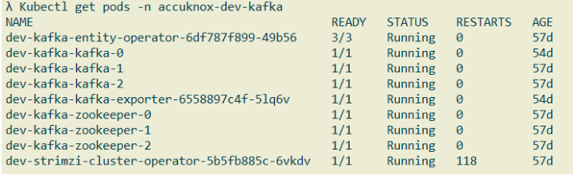
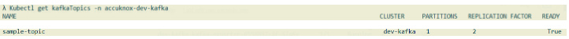

Check Pods Running status:

```sh
kubectl get pods -n accuknox-dev-kafka
```


Check Kafka Cluster status:
```sh
kubectl get kafka -n accuknox-dev-kafka
```


Check Kafka Topics status:
```sh
kubectl get kafkaTopics -n accuknox-dev-kafka
```

