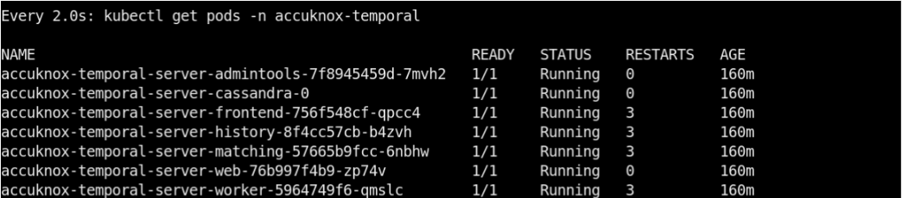
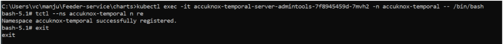

### Temporal Operator Deployment

#### 1. Please create a namespace of your choice. Example : temporal-server
```sh
kubectl create ns temporal-server
```

#### 2. Clone the git repository
 - git clone https://github.com/temporalio/helm-charts.git
 - mv helm-charts temporal-server-chart
 - Navigate into the directory that holds helm-charts folder.

#### 3.Helm Install
```sh
helm upgrade --install accuknox-temporal-server temporal-server-chart  --set server.replicaCount=1 --set cassandra.config.cluster_size=1 --set prometheus.enabled=false --set grafana.enabled=false --set elasticsearch.enabled=false --timeout 15m -n accuknox-temporal
```
If Prometheus/ Grafana is not required, please use the below command.

```sh
helm install --set server.replicaCount=1 --set cassandra.config.cluster_size=1 --set prometheus.enabled=false --set grafana.enabled=false --set elasticsearch.enabled=false temporal . --timeout 15m -n temporal-server
kubectl get all -n temporal-server
```


#### 4 .Set the Default Namespace
```sh
Syntax:

kubectl exec -n temporal-server -it  pod/temporaltest-admintools-<pod-id> -- /bin/bash tctl --ns default n re
```
Example:



#### 5 .Successful Installation
- Port-forward the temporal-web (:8088) pod to view the temporal workflows UI.
```sh
kubectl port-forward svc/temporaltest-web 8088:8088 -n temporal-server
```
