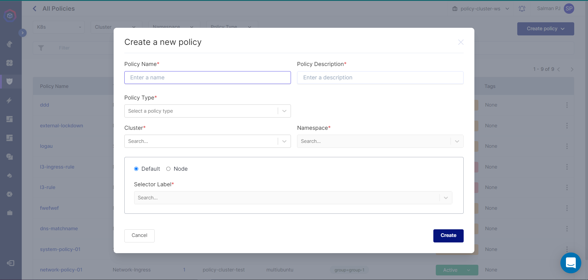

## Policy Management Life Cycle

Once you successfully onboarded the cluster. You are good to go.

You can create policies from scratch to secure your cloud environment. You can also make use of auto discovered policies and a number of predefined recommended policies.

### **Overview**

1.  Create/Add policy
    
2.  Define basic parameters like cluster, namespace etc.
    
3.  Add Rules
    
4.  Approve Policy
    

### **Create Policy Manually:**

From two screens you can create/Add Policies.

#### **Add Policy from Cluster Manager Dashboard.**

1.  Log in to Accuknox select `Cluster Manager Dashboard` from the left navigation bar.
    
2.  Right Click on any entity such as node and pod.
    
3.  Select `Add Policy`
    

#### **Create Policy from Policy Manager**

1.  Log in to Accuknox and select `Policy Manager` -> `All Policies`
    
2.  On the All Policies page, select `Create Policy`
    

### **Define basic policy parameters**

Define the basic parameters of the policy before adding the rules.

-   Policy Name
    
    -   Name of the Policy
        
-   Description
    
    -   Description for the Policy
        
-   Policy Type
    
    -   Policy Type can be Network-Ingress, Network-Egress and System. Ingress-Policy will apply to all network packets which are entering the endpoint. Egress-Policy will apply to all network packets which are leaving the endpoint. System Policy will restrict behavior at system level.
        
    -   To set up the network security select policy type to be Network-ingress or Network-egress.
        
-   Namespace
    
    -   Namespace will tell in which namespace that policy is going to apply.
        
-   Default/Node
    
    -   This is used to differentiate between Endpoint Selector(default) and Node Selector(Node). It is called Endpoint Selector because it only applies to labels associated with an Endpoint. Node Selector applies to labels associated with a node in the cluster.
        
-   Labels
    
    -   Labels are used to select specified endpoints (in most cases it will be pods) and nodes.

### **Create/Add Network Policy**

To set up the network security policies select policy type to be Network-ingress or Network-egress when you define policy type. 

select 'Create/Add Policy' -> 'Policy type' -> 'Network-ingress/Network-egress' 

### **Create/Add Kubearmor(System) Policy**

To set up the application security policies select policy type to be System when you define policy type. 

select 'Create/Add Policy' → 'Policy type' -> 'System'

### **Add Rules**

Once the Policy has been created, You will be directed to the Add rules screen.

Another way is to select Policy Manager → All Policies. Selecting a policy from All Policies list page will expand the policy details and access `+` icon to add rules.

The Add rule interface provides an easy way to add rules to or remove rules from a Policy; Rules will differ based on your policy type you chose.

See also: Policies and Rules

### **Approve Policy**

After you add the rules to policy, Policy will be shifted to `Pending` state. Then to make it active, you need to approve the policy.

1.  Select `Policy Manager` -> `Pending Approval`
    
2.  On the Pending Approval list page, `Approve` your specific policy.
    
3.  Go to `Policy Manager` -> `All Policies` list page, You can see recently approved policy with status `active`.
    

### **Edit Policy**

Select a row in the All policies list to expand the policy details and access the `+`icon to `Edit` the policy by adding new rules.

You can also edit/delete the existing rules by accessing the three dots icon appearing on the right end of specific rules.

### **Delete Policy**

1.  Select `Policy Manager` -> `All Policies`
    
2.  Click three dot icon on the right end of a specific row.
    
3.  Click `Delete Policy`.
    

### **Auto discovered policies**

Auto Discovery is a policy recommendation system that suggests network and system policies based on the collected network and system logs respectively.

You can review and apply the auto discovered policies.

Applying auto discovered network policies will strengthen your network security.

1.  Select Policy Manager → Auto Discovered Policies
    
2.  On the Auto Discovered Policies list page, you can filter out different types of policies.
    
3.  Select one or more policies by ticking the rows.
    
4.  Select `Action` -> `Apply`
    
5.  Select `Policy Manager` -> `Pending Approval` -> `Approve`
    

See also: Auto Discovered Policies

### **Recommended policies**

Accuknox provides a number of out-of-the-box recommended policies based on popular workloads or for the host. These policies are recommended to you only after analyzing your workloads and hosts.

These policies will cover known CVEs and attack vectors, compliance frameworks (such as MITRE, PCI-DSS, STIG, etc.) and many more.

1.  Select `Policy Manager` -> `Recommended Policies`
    
2.  On the Recommended Policies list page, You can see all the recommended policies based on your workloads and hosts.
    
3.  Select one or more policies, the click `Apply`
    
4.  On the `Apply` page, selector labels will be preselected associated with your workloads. You can review labels and if you want to change the labels you can also do it. Selector labels will decide where selected policies are going to apply.
    
5.  After Apply; Select `Policy Manager` -> `Pending Approval` -> `Approve`
