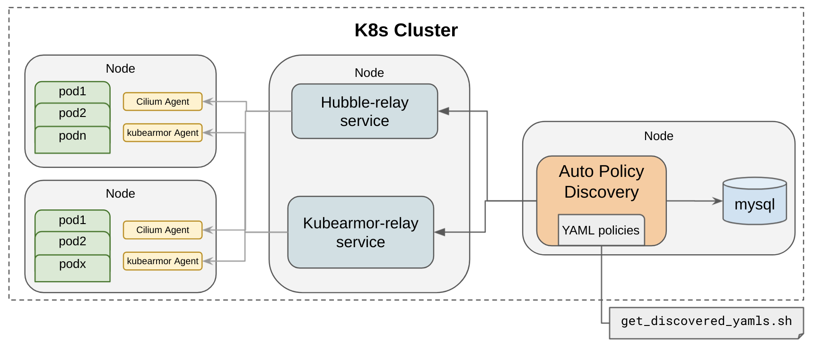

# Setup Instructions

This install instructions allow you to setup sample cluster with:
* Cilium CNI
* Kubearmor Application Protection Engine
* Auto Policy Discovery Engine
* Command line tools



## 1. Install sample k8s cluster

=== "Local k3s cluster"
	
    **Install k3s**
		
	```
	curl -sfL https://get.k3s.io | INSTALL_K3S_EXEC='--flannel-backend=none' sh -s - --write-kubeconfig-mode 644
	```
		
	**Make k3s cluster config the default**
	
	```
	export KUBECONFIG=/etc/rancher/k3s/k3s.yaml
	```
	You can add this to your `.bashrc`. (Note that any other k8s cluster will not be reachable using `kubectl` once you override `KUBECONFIG`).

=== "EKS cluster"

	```
	apiVersion: eksctl.io/v1alpha5
	kind: ClusterConfig

	metadata:
	  name: kubearmor-ub20
	  region: us-east-2

	nodeGroups:
	  - name: ng-1
        amiFamily: "Ubuntu2004"
        privateNetworking: true
        desiredCapacity: 2
        # taint nodes so that application pods are
        # not scheduled until Cilium is deployed.
	    taints:
	     - key: "node.cilium.io/agent-not-ready"
           value: "true"
           effect: "NoSchedule"
        ssh:
          allow: true
        preBootstrapCommands:
          - "sudo apt install linux-headers-$(uname -r)"
	```

## 2. Install Daemonsets and Services

```
curl -s https://raw.githubusercontent.com/accuknox/tools/main/install.sh | bash
```
This will install all the components. 
!!! Output from _kubectl get pods -A_
	```
	NAMESPACE     NAME                                             READY   STATUS      RESTARTS   AGE
	kube-system   helm-install-traefik-crd-gwlpt                   0/1     Completed   0          3h17m
	kube-system   helm-install-traefik-lzkqg                       0/1     Completed   1          3h17m
	kube-system   svclb-traefik-47bc4                              2/2     Running     2          3h9m
	kube-system   metrics-server-86cbb8457f-cw9jd                  1/1     Running     1          3h9m
	kube-system   local-path-provisioner-7c7846d5f8-kxdxj          1/1     Running     1          3h3m
	kube-system   coredns-7448499f4d-qk6pv                         1/1     Running     0          15m
	kube-system   traefik-5ffb8d6846-w8clc                         1/1     Running     1          3h3m
	kube-system   cilium-operator-6bbdb895b5-ff752                 1/1     Running     0          12m
	kube-system   hubble-relay-84999fcb48-8d5ss                    1/1     Running     0          11m
	kube-system   cilium-wkgzn                                     1/1     Running     0          11m
	explorer      mysql-0                                          1/1     Running     0          10m
	kube-system   kubearmor-67jtk                                  1/1     Running     0          8m34s
	kube-system   kubearmor-policy-manager-986bd8dbc-4s79d         2/2     Running     0          8m34s
	kube-system   kubearmor-host-policy-manager-5bcccfc4f5-gkbck   2/2     Running     0          8m34s
	kube-system   kubearmor-relay-645667c695-brzpg                 1/1     Running     0          8m34s
	explorer      knoxautopolicy-6bf6c98dbb-pfwt9                  1/1     Running     0          8m20s
	```
	
	We have following installed:
	* kubearmor protection engine
	* cilium CNI
	* Auto policy discovery engine
	* MySQL database to keep discovered policies
	* Hubble Relay and KubeArmor Relay

## 3. Install Sample k8s application

Install anyone of the following app or you can try your own k8s app.

=== "Wordpress-Mysql App"
	```
	kubectl apply -f https://raw.githubusercontent.com/kubearmor/KubeArmor/main/examples/wordpress-mysql/wordpress-mysql-deployment.yaml
	```

=== "Online Boutique: Google Microservice Demo App"
	
	Application Reference](https://github.com/GoogleCloudPlatform/microservices-demo)
	
	```
	kubectl apply -f https://raw.githubusercontent.com/GoogleCloudPlatform/microservices-demo/master/release/kubernetes-manifests.yaml
	```

## 4. Get Auto Discovered Policies

```bash
curl -s https://raw.githubusercontent.com/accuknox/tools/main/get_discovered_yamls.sh | bash
```

!!! Output of _get_discovered_policies.sh_
	```bash
	❯ curl -s https://raw.githubusercontent.com/accuknox/tools/main/get_discovered_yamls.sh | bash
	Downloading discovered policies from pod=knoxautopolicy-6bf6c98dbb-pfwt9
	Got 38 cilium policies for namespace=default in file cilium_policies_default.yaml
	Got 4 cilium policies for namespace=explorer in file cilium_policies_explorer.yaml
	Got 13 cilium policies for namespace=kube-system in file cilium_policies_kube-system.yaml
	Got 38 knox policies for namespace=default in file knox_net_policies_default.yaml
	Got 4 knox policies for namespace=explorer in file knox_net_policies_explorer.yaml
	Got 13 knox policies for namespace=kube-system in file knox_net_policies_kube-system.yaml
	Got 146 kubearmor policies in file kubearmor_policies.yaml
	```

## 5. Uninstall

```
curl -s https://raw.githubusercontent.com/accuknox/tools/main/uninstall.sh | bash
```

